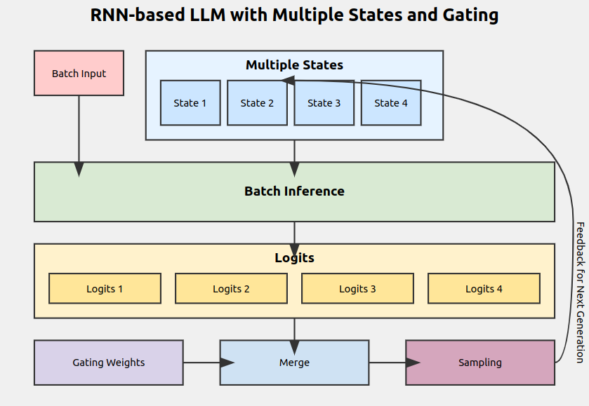

# RWKV-Infer
<p align='center'>
<image src="kotori.webp" />
    
</p>

<div align="center"> 

## Implement - Multi Recurrent State Sampling (MRSS)
   - 1. For a single model, we apply multiple RNN timestates and set Gating Weights. We perform inference for each of these states, merge the resulting probability spaces using the Gating Weights, and then sample from this merged space. This enables inference that takes into account the learning results from multiple states.
   - 2. By utilizing FLA (Flash Linear Attention) for simultaneous multiple inferences, we can minimize the processing speed reduction even when applying MRSS.
   - 3. For example, by using MRSS to perform inference with both a TimeState tuned for specialized knowledge and a TimeState tuned for conversational tone, it becomes possible to achieve inference that balances both knowledge and tone.
   - 4. The Gating Weights in MRSS can be adjusted for each inference batch. This allows for dynamic control of the dependency ratio for each State. In the future, we plan to implement dynamic Gating Weight adjustment using a neural network.



## How To Use
   - 1. Install Latest? Pytorch with Cuda(2.2+ tested)
   - 2. install requirements with triton==2.2.0
```sh
pip install -r requirements.txt
```    
   - 3. prepare models in models folder
   - 4. prepare states in states folder
   - 5. Run Server 
```sh
python rwkv_server_fla_fastapi.py --localhost 0.0.0.0 --port 9000 --debug False --workers 64 --dynamic_state_cache_size 512
```     
   - 6. Load Model if quant, set model_strategy:quant
```sh
curl http://127.0.0.1:9000/loadmodel -X POST -H "Content-Type: application/json" -d '{"model_filename":"models/RWKV-x060-World-1B6-v2.1-20240328-ctx4096.pth","model_viewname":"RWKV x060 1B6 Base","model_strategy":""}'
```
   - 7. Enjoy Infernce via OpenAI Compatible API!


## API Examples
   - 1. Model Load
```sh
curl http://127.0.0.1:9000/loadmodel -X POST -H "Content-Type: application/json" -d '{"model_filename":"models/RWKV-x060-World-1B6-v2.1-20240328-ctx4096.pth","model_viewname":"RWKV x060 1B6 Base","model_strategy":"","default_temperature":"1.0", "default_top_p":"0.3"}'
```
   - 2. Add Single state
```sh
curl http://127.0.0.1:9000/loadstatemodel -X POST -H "Content-Type: application/json" -d '{"state_filename":"state.pth","state_viewname":"State Test","default_temperature":"1.0", "default_top_p":"0.3"}'
```
   - 3. Add MRSS states
```sh
curl http://127.0.0.1:9000/mrss_loadstatemodel -X POST -H "Content-Type: application/json" -d '{"state_viewname":"MRSS Test", "state_filenames":["states/jp7b-bancho.pth","states/ojousama2.pth","states/secret.pth"], "contain_originalstate":"True", "state_gatingweight":["0.01","0.3","0.4","0.03"],"default_temperature":"1.0", "default_top_p":"0.8"}'
```
   - 4. Remove All State
```sh
curl http://127.0.0.1:9000/removestatemodel -X POST -H "Content-Type: application/json" -d '{"dummy":"dummy"}'
```
   - 5. Get Model Names (During inference, setting the same name as this ID will enable dynamic state loading.)
```sh
curl http://127.0.0.1:9000/models -X GET
```

## Thanks for
   - RWKV-LM,ChatRWKV @BlinkDL
   - rwkv.hpp @harrisonvanderbyl
   - RWKV-PEFT @Jl-er
   - flash-linear-attention @ sustcsonglin


## ToDo for me
   - Improve FLA Stability on bf16 - maybe done.
   - Implement Multi Recurrent State Sampling - in experiment
   - Implement MRSS GatingLayer in coding.
   - Speculative Decoding - In Experiment. but currently suspended.
   
2024 OpenMOSE
